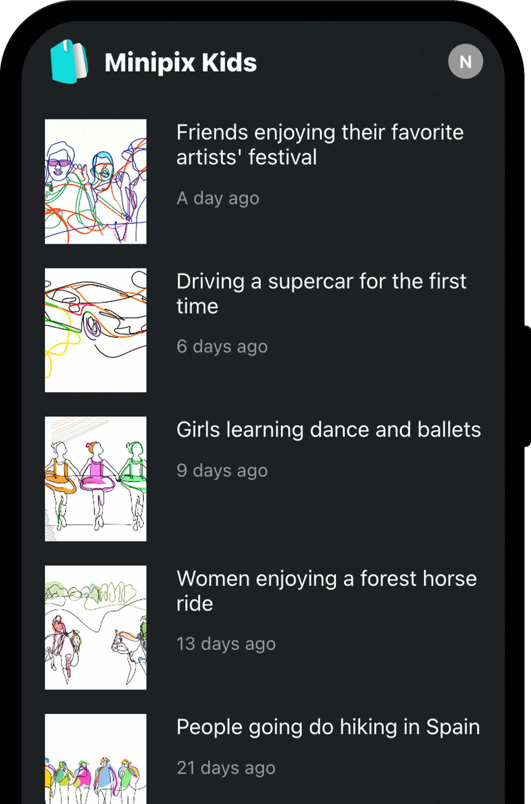
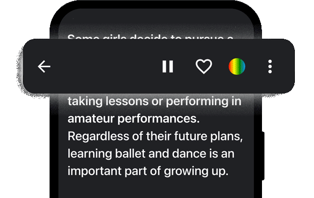

  

# Table of Contents
1. [About](#about)
2. [Live Demo](#live-demo-of-colorization)  
3. [4 Core Features](#4-core-features)  
4. [Libraries (NPM)](#libraries-npm)  
5. [Code References](#code-references)
6. [UI Screenshots](#ui-screenshots)

---

## 1. About
This API creates interactive stories for kids based on user prompts. It handles everything from generating text to creating multimedia elements, including text-to-text, text-to-GIF, text-to-image, and text-to-audio.

> Note: Note: This project also includes a UI that interacts with this API to generate and display AI-generated stories. Some screenshots are at the end.

## 2. Live Demo
You can see how illustrations can be re-colored at the [**Live Demo**](https://nq-portfolio.com/recoloring/demo).

## 3. Core Components

### - Story API Endpoint
  - **NoSQL CRUD operations**: Stores and retrieves stories, supports user engagement (reading, liking, tracking interactions), and fetches stories based on subscription plans (Free/Premium).
  - **Illustrations**: Generates 10–20 AI-generated images for each story.
  - **Text-to-Speech**: Two distinct voice options generate audio files for narration.
  - **3D Collectibles**: Each story includes a unique, animated 3D asset in mesh and GIF format.

### - GIF Processing
  - Converts images into GIF format.
  - Removes the background from GIFs.
  - Watermarks GIFs with a logo (similar to TikTok).

### - Image Processing
  - Modifies the color of story illustrations to fit themes or user preferences.
  - Uses advanced colorization techniques for customization.

### - Audio Processing
  - Merges multiple audio segments into a single file.
  - Generates text-to-speech audio for seamless narration.

## 4. Libraries (NPM)
- `jimp`
- `omggif`, `gifencoder`, `pngjs`
- `canvas`
- `axios`, `express`
- `aws-sdk` or similar for S3 integration
- `firebase-admin` or `@google-cloud/firestore` for NoSQL

## 5. Code References
- **Story Handler**: [`src/handlers/story/handler.ts`](./src/handlers/story/handler.ts) The main API endpoint handling story requests and interactions.
- **GIF**: [`src/lib/gifProcessing.ts`](./src/lib/gifProcessing.ts) Manages GIF creation, background removal, and watermarking.
- **Audio**: [`src/lib/audioProcessing.ts`](./src/lib/audioProcessing.ts) Manages audio merging and processing.
- **Images**: [`src/lib/imageProcessing.ts`](./src/lib/imageProcessing.ts)  Handles image color adjustments.

## 6. UI Screenshots

> The homepage of the website features stories generated by the user.

   
> The UI allows users to play the narration of a story, like it, modify the color of its images, and more.

